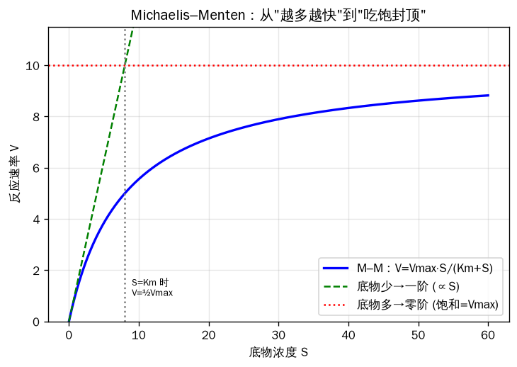

# Round 2：土壤生物地球化学集群（入门→中级）
## 从"单桶一阶衰减"升级到"多桶级联 + 质地保护 + 微生物显式非线性动力学"

---

## SECTION 0：从 Round 1 架起桥梁

在 Round 1 里，你已经掌握了土壤碳的最简单图像：**一个浴缸（单一碳库）+ 一个排水口**。排水速率正比于缸里的水量，写成微分方程就是：

dC/dt = −k · C

- C：碳库大小（kg C/ha 或 mg C/cm³）
- k：一阶分解速率常数（1/yr），代表"每年流失的比例"
- dC/dt：碳库随时间的变化率

我们还学了"速率修正因子"（rate modifiers）：真实的 k 会被温度、湿度调节，写成 k_eff = k · f(T) · f(W)。RothC、AquaCrop 都是建立在这种"线性一阶 + 修正因子"的思路上。这种模型的核心特征是 **线性**：把输入加倍，稳态碳储量也恰好加倍；它永远单调地趋向一个平衡点，不会震荡。

Round 2 要做三件升级，把这套简单图像扩展成真正的土壤生物地球化学模型：

**升级 1：多个耦合碳库 + 级联（cascade）。** 不再是一个浴缸，而是 **一串相互连接的浴缸**：凋落物缸的水流进"活性"缸，活性缸的水一部分流进"慢"缸和"被动"缸，每一级转移时都有一部分以 CO₂ 形式"蒸发"损失掉。这就是 CENTURY/DAYCENT 的多库级联结构。

**升级 2：质地保护（texture protection）。** 黏土（clay）和粉砂（silt）颗粒能在物理上"抱住"有机质，让它接触不到分解者，从而 **减慢分解、提高稳定化效率**。同样多的碳输入，黏土多的地方能存住更多碳。

**升级 3：微生物显式的非线性动力学（Michaelis–Menten）。** 这是最根本的范式转变。在一阶模型里，分解速率只取决于底物 C；但真实分解是 **微生物（酶）干出来的活**，速率同时取决于底物 **和** 微生物生物量，并且会"饱和"。这把线性模型变成了非线性模型，能产生一阶模型在结构上根本产生不了的行为：多重平衡、激发效应（priming）、甚至震荡。

本轮的关键新数学工具就是 **Michaelis–Menten 方程**，我们先从第一性原理把它讲透。

---

## SECTION 1：Michaelis–Menten 动力学（本轮的核心第一性原理）

### 1.1 方程与每个符号

Michaelis–Menten（米氏）方程描述酶催化反应速率如何随底物浓度变化：

**V = Vmax · S / (Km + S)**

逐符号解释：
- **V**：反应速率（reaction velocity / rate），即单位时间分解掉多少底物。
- **Vmax**：最大反应速率（maximum rate）。当底物多到把所有酶都"占满"（饱和）时能达到的上限速率。Vmax 与酶（这里是微生物）的数量成正比——酶加倍，Vmax 加倍。
- **S**：底物浓度（substrate concentration），在土壤里就是可分解的有机碳浓度。
- **Km**：半饱和常数（half-saturation constant，又叫 Michaelis 常数）。它的物理意义非常直观：**当 S = Km 时，V 恰好等于 Vmax 的一半**。Km 越小，酶对底物的亲和力越高（很低的底物浓度就能跑到半速）。



<small>↑ Michaelis–Menten：底物少时近似一阶（∝S），底物多时饱和封顶到 Vmax。</small>


### 1.2 收银台类比

想象一家超市收银台。**顾客 = 底物 S，收银员 = 酶/微生物，结账速度 = V。**

- 顾客很少时（S 很小）：收银员闲着，来一个结一个，结账总速率几乎正比于顾客流量——这时近似 **线性**。
- 顾客爆满时（S 很大）：收银员手已经飞快，再多顾客也只能排队，结账速率顶到天花板 Vmax——这就是 **饱和**。
- Km 就是"当结账速率达到最大一半时门口排了多少顾客"。一个手脚麻利（高亲和力）的收银员，很少顾客就能达到半速，对应小 Km。

关键洞见：**多请一个收银员（增加微生物生物量），天花板 Vmax 就抬高。** 这正是米氏动力学和一阶动力学最根本的区别——速率依赖"工人"的数量。

### 1.3 与一阶、零阶动力学对比

把米氏方程在两个极端展开，就能看清它如何"包含"了一阶和零阶：

- **当 S ≪ Km（底物稀少）**：分母 Km + S ≈ Km，于是 V ≈ (Vmax/Km) · S。这是 **一阶动力学**（V 正比于 S），就是 Round 1 的 dC/dt = −k·C，其中 k = Vmax/Km。
- **当 S ≫ Km（底物饱和）**：分母 Km + S ≈ S，于是 V ≈ Vmax。这是 **零阶动力学**（速率恒定，与 S 无关）。

所以米氏曲线是一条 **从原点近似直线上升、然后弯折趋于水平渐近线 Vmax 的双曲线**。一阶动力学（V = k·S）则是一条永远不饱和的直线，底物越多速率越快，没有上限——这在底物极多时显然不真实。

### 1.4 为什么这对土壤碳至关重要

在 RothC、CENTURY 这类线性模型里，分解速率只看底物多少，**隐含假设微生物永远够用、永不饱和**。但真实土壤里：

1. 分解是 **微生物用胞外酶（extracellular enzymes）干的**，酶（微生物）数量有限，会饱和；
2. 分解速率 **同时依赖微生物生物量**——微生物多，Vmax 高，分解快。

把微生物生物量 MIC 显式放进速率定律（如 V = Vmax · MIC · S / (Km + S)），系统就变成非线性，能展现线性模型 **结构上无法产生** 的现象：对扰动的非单调响应、激发效应、多重稳态，甚至 5–15 年周期的阻尼震荡。Wang, Chen, Wieder et al.（2014, Biogeosciences 11:1817–1831）用稳定性分析证明：两库与三库非线性微生物模型"对小扰动呈现阻尼震荡响应（damped oscillatory responses to small perturbations）"，振荡频率正比于 √(ε⁻¹−1)·K/V（ε 为微生物生长效率，K、V 为半饱和常数与最大分解速率），周期约 5–15 年；而对应的线性模型总是单调趋于稳态。这是 SECTION 5（MIMICS）的伏笔。

米氏动力学在土壤里的现代应用有坚实数据支撑：German, Marcelo, Stone & Allison（2012, Global Change Biology 18:1468–1479）实测了从北方针叶林到热带雨林五个样点、五种水解酶（cellobiohydrolase、β-glucosidase、β-xylosidase、α-glucosidase、N-acetyl-β-D-glucosaminidase）的 Vmax 与 Km，测得 Q10 范围为"1.53 到 2.27（Vmax）、0.90 到 1.57（Km）"，证明土壤胞外酶确实遵循米氏动力学且其 Vmax 与 Km 都对温度敏感——这正是 MIMICS 模型的参数来源。

### 1.5 小小数值算例

设某土壤酶 Vmax = 10 mg C·cm⁻³·d⁻¹，Km = 5 mg C·cm⁻³。

- S = 1（远小于 Km）：V = 10·1/(5+1) = 1.67。底物翻倍到 S = 2：V = 10·2/(5+2) = 2.86，几乎也翻倍（1.67→2.86，约 1.7 倍）——接近线性。
- S = 5（= Km）：V = 10·5/(5+5) = 5.0 = Vmax 的一半。✓ 验证了 Km 的定义。
- S = 50（远大于 Km）：V = 10·50/(5+50) = 9.09。底物再翻倍到 S = 100：V = 10·100/105 = 9.52，几乎不动——彻底饱和。

同样"底物翻倍"，在低浓度区速率几乎翻倍，在高浓度区速率几乎不变。这种"看你站在曲线哪一段"的非线性，就是后面所有有趣行为的根源。

### 1.6 带注释的 Python：米氏曲线 vs 线性曲线

```python
import numpy as np
import matplotlib.pyplot as plt

# ---- 参数 ----
Vmax = 10.0   # 最大反应速率 (mg C / cm3 / day)
Km   = 5.0    # 半饱和常数 (mg C / cm3)，S=Km 时 V=Vmax/2
k    = Vmax / Km   # 让线性模型在低浓度处与米氏曲线相切：k = Vmax/Km

# ---- 底物浓度范围 ----
S = np.linspace(0, 60, 300)   # 从 0 到 60 mg C/cm3

# ---- 两种动力学 ----
V_mm     = Vmax * S / (Km + S)   # Michaelis–Menten（会饱和）
V_linear = k * S                 # 一阶/线性（永不饱和）

# ---- 画图 ----
plt.figure(figsize=(7,5))
plt.plot(S, V_mm,     label="Michaelis–Menten: V=Vmax·S/(Km+S)", lw=2)
plt.plot(S, V_linear, '--', label="一阶线性: V=k·S", lw=2)
plt.axhline(Vmax, color='gray', ls=':', label="Vmax 天花板")
plt.axhline(Vmax/2, color='orange', ls=':')
plt.axvline(Km, color='orange', ls=':', label="S=Km → V=Vmax/2")
plt.xlabel("底物浓度 S (mg C/cm3)")
plt.ylabel("反应速率 V")
plt.legend(); plt.title("米氏饱和 vs 线性不饱和")
plt.tight_layout(); plt.show()
```

运行后你会看到：两条线在原点附近重合（低浓度时米氏≈线性），但米氏曲线很快弯下、压到 Vmax 天花板之下，而线性那条一路冲天。这张图就是 Round 1 与本轮非线性世界的分界线。

**原始文献：** Michaelis L. & Menten M.L. (1913) "Die Kinetik der Invertinwirkung", Biochemische Zeitschrift 49:333–369；土壤现代应用见 German et al. (2012, GCB 18:1468–1479)。

---

## SECTION 2：CENTURY（多库 + 质地保护 + 养分耦合）

### 2.1 第一性原理：按"周转时间"切分有机质

CENTURY 模型由 Parton, Schimel, Cole & Ojima 于 1987 年发表（Soil Science Society of America Journal 51:1173–1179）。它的核心思想：土壤有机质（SOM）不是均一的一锅粥，而应该按 **周转时间（turnover time）** 切成几个库。

CENTURY 把 SOM 分成三个库：

| 库 | 代表物质 | 周转时间 |
|---|---|---|
| **Active（活性库）** | 微生物 + 微生物产物 + 易分解物 | 数月到几年（约 1–5 年） |
| **Slow（慢库）** | 抗分解的植物物质（木质素类）+ 物理保护的有机质 | 约 20–50 年 |
| **Passive（被动库）** | 物理化学双重稳定、极难分解的有机质 | 约 400–2000 年 |

此外，进入土壤的 **植物凋落物（litter）** 先按质量切成两半：
- **Metabolic（代谢库）**：易分解部分（糖、蛋白、氨基酸）。
- **Structural（结构库）**：难分解部分（木质素 lignin、纤维素、细胞壁）。

切分依据是凋落物的 **木质素/氮比（lignin-to-nitrogen ratio，L/N）**。代谢库占比由形如 fmet = a − b·(lignin/N) 的线性函数决定：L/N 越高（越"木质化"），进入结构库的比例越大。

### 2.2 三个机制

**(a) 一阶衰减 + 级联。** 每个库本身仍按 **一阶动力学** 衰减（这点和 Round 1 一样），但衰减常数被温度、湿度因子调节：实际速率 = 潜在速率 × f(T) × f(W) ×（结构库还要乘木质素抑制因子）。注意 CENTURY **不是** 微生物显式的——它没有把微生物生物量放进速率定律，它仍是线性模型。关键升级在于碳在库之间 **级联流动**：

litter → structural / metabolic → active → slow / passive

每一步转移都按固定效率进行，并在每一步损失一部分 CO₂。慢库可以再活化回活性库，被动库也能少量回流，形成一个有反馈的网络。

**(b) 质地效应（texture effect）——本节最关键的新机制。** 土壤砂/黏含量从两方面控制碳动态：
1. **控制活性库的周转速率**：砂质土里活性库周转 **更快**（碳留不住）；
2. **控制 active→slow 的稳定化效率**：黏土含量越高，分解产物进入慢库/被动库的比例 **越高**（碳被黏土保护并稳定下来）。

直观理解：黏土像无数个微型保险箱，把微生物产物锁起来，既减慢分解又提高长期封存。这就是"质地保护"的数学化身。CENTURY 还用一个排水参数 DRAIN 表征湿度（DRAIN=1 砂质良好排水，DRAIN=0 黏质排水不良），厌氧（高含水）会降低分解。

**(c) C:N:P:S 化学计量耦合。** CENTURY 同时追踪碳和氮、磷、硫。每个库有自己的 C:N 比，分解时根据底物 C:N 与可用矿质氮决定是 **矿化（释放）** 还是 **固定（吸收）** 氮。活性库有一个临界 C:N 比（RCN）决定矿化还是固定。这让 CENTURY 不只是碳模型，而是耦合的养分循环模型。

### 2.3 概念流程图

```
        植物凋落物 litter
        ┌──────┴──────┐  (按 lignin/N 切分)
   Metabolic        Structural
   (易分解)          (木质素/纤维素)
        │                │
        └──→  ACTIVE  ←──┘      ── CO₂↑ (每步都损失)
              (微生物/活性, ~1–5 yr)
              │        │
        (黏土↑稳定化↑) │
              ▼        ▼
            SLOW  ⇄  ACTIVE     SLOW: ~20–50 yr
              │
              ▼
           PASSIVE                PASSIVE: ~400–2000 yr
       (物理化学稳定)
   每一次箭头转移都伴随 CO₂ 呼吸损失 + 氮的矿化/固定
```

### 2.4 worked example：高木质素 vs 低木质素残体

- **小麦秸秆（wheat straw，高 L/N）**：木质素多、氮少，L/N 高 → fmet 小 → 大部分碳进入 **结构库**，再缓慢流向 **慢库**，分解慢、留存久，但养分释放慢。
- **豆科绿肥（legume，低 L/N）**：氮多、木质素少，L/N 低 → fmet 大 → 大部分碳进入 **代谢库**，快速被 **活性库** 分解，碳迅速周转（更多很快变 CO₂），同时快速释放氮供作物利用。

这解释了一个田间常识：想快速供氮，用豆科绿肥；想长期累积土壤碳/慢库，留高木质素秸秆。同一个模型用 L/N 一个参数就把这条经验定量化了。

### 2.5 带注释的 Python：简化三库 CENTURY 跑到稳态

```python
import numpy as np
import matplotlib.pyplot as plt

# ====== 简化的 3 库 CENTURY 风格模型 (active/slow/passive) ======
# 仅用于教学：一阶衰减 + 库间级联 + 质地依赖的稳定化效率

# ---- 一阶周转速率 (1/yr)，由周转时间倒数得到 ----
k_act  = 1/1.5     # active: 周转 ~1.5 yr
k_slow = 1/25.0    # slow:   周转 ~25 yr
k_pass = 1/1000.0  # passive:周转 ~1000 yr

def run_century(clay_fraction, years=3000, dt=1/12,
                litter_in=300.0):
    """
    clay_fraction: 黏粒比例 (0–1)，越高 -> 稳定化效率越高、active 周转略慢
    litter_in: 年凋落物碳输入 (g C/m2/yr)，全部先进 active (简化)
    """
    # 质地效应1：黏土越多，active->slow/passive 的稳定化比例越高
    f_act_to_slow = 0.30 + 0.40 * clay_fraction   # 进入 slow 的比例
    f_act_to_pass = 0.01 + 0.03 * clay_fraction   # 进入 passive 的比例
    # 质地效应2：砂质(低黏土)中 active 周转更快
    k_act_eff = k_act * (1.0 - 0.5 * clay_fraction)
    # slow -> passive 的稳定化也随黏土升高
    f_slow_to_pass = 0.03 + 0.10 * clay_fraction

    C = np.array([10.0, 50.0, 100.0])  # [active, slow, passive] 初值
    steps = int(years/dt)
    for _ in range(steps):
        A, S, P = C
        # 各库一阶分解量 (这一步分解掉多少)
        dA = k_act_eff * A
        dS = k_slow    * S
        dP = k_pass    * P
        # active 分解产物：一部分稳定进 slow/passive，其余 CO2 损失
        to_slow = dA * f_act_to_slow
        to_pass = dA * f_act_to_pass
        # slow 分解产物：一部分进 passive，一部分回 active，其余 CO2
        s_to_pass = dS * f_slow_to_pass
        s_to_act  = dS * 0.20
        # passive 少量回流 active
        p_to_act  = dP * 0.10
        # ---- 更新（显式 Euler，呼应 Framework ③ rate→integrate→update）----
        A_new = A + dt*(litter_in + s_to_act + p_to_act - dA)
        S_new = S + dt*(to_slow - dS)
        P_new = P + dt*(to_pass + s_to_pass - dP)
        C = np.array([A_new, S_new, P_new])
    return C

# ---- 测试质地效应：砂土 vs 黏土 ----
for clay in [0.10, 0.40]:
    A,S,P = run_century(clay)
    print(f"黏粒={clay:.0%}: active={A:.1f}  slow={S:.1f}  "
          f"passive={P:.1f}  总SOC={A+S+P:.1f} g C/m2")
```

运行后你会看到：**黏粒比例从 10% 提到 40%，稳态总 SOC 明显上升**，且增量主要堆在 slow 和 passive 库里——这就是"质地保护"在数值上的体现。把它跟 Round 1 的单库模型对照：同样的输入，CENTURY 因为有多库 + 质地稳定化，能把更多碳"锁"在慢周转库里。

### 2.6 案例研究

**案例 1：美国大平原草地 SOM 分析（原始论文）。** Parton et al.（1987）用该模型模拟了美国大平原 24 个草地站点的稳态有机质水平，横跨一个气候/质地梯度。结论：模型能重现气候梯度对 SOM 和生产力的影响，而且 **土壤质地是有机质动态的一个主控因子（"Soil texture was also a major control over organic matter dynamics"）**，在砂质、中质、黏质土上都能较好地预测地上生产力与土壤 C、N 水平；论文也坦承模型对 **细质土的 C、N 倾向高估约 10–15%**（"the model tended to overestimate soil C and N levels for fine textured soil by 10 to 15%"）。这是"质地保护"思想的奠基性实证，也提醒我们机理模型并非处处完美。

**案例 2：CENTURY 作为 DSSAT 的 SOM 模块。** Gijsman et al.（2002, Agronomy Journal 94:462–474）把 CENTURY 的 SOM-残体模块嫁接进 DSSAT 作物模型，替换掉 DSSAT 原来"只认一种腐殖质、新腐殖质固定 C:N=10、且 SOM 流动与质地无关"的简化处理，使其能模拟低投入农业系统中的有机质周转与养分供给。这说明 CENTURY 的多库框架已成为作物模型的标准土壤碳引擎。

### 2.7 连接思维框架

- **框架①（守恒/库—通量）**：碳在多库间流动 + CO₂ 损失，质量守恒。
- **框架②（乘法限制因子 potential×stress）**：实际分解 = 潜在速率 × f(T) × f(W) × 木质素因子，多个胁迫因子相乘。
- **框架③（rate→integrate→update）**：每个时间步算速率、积分、更新库——和代码里的显式 Euler 一致。

---

## SECTION 3：DNDC（厌氧气球——氧化还原驱动的生物地球化学）

### 3.1 第一性原理：两组件、六子模型

DNDC（DeNitrification-DeComposition）由 Changsheng Li（李长生）等于 1992 年发表（Li et al. 1992），最初用于模拟美国农田的 N₂O 排放。它的结构是 **两大组件、六个子模型**：

**组件 1（把环境翻译成"土壤状态"）**：soil climate（土壤气候）、crop growth（作物生长）、decomposition（分解）三个子模型，把天气、土壤、管理输入转换成土壤的 **温度、湿度、pH、Eh（氧化还原电位 redox potential）、底物浓度** 等环境变量。

**组件 2（把土壤状态翻译成"气体通量"）**：nitrification（硝化）、denitrification（反硝化）、fermentation（发酵）三个子模型，用上述环境变量预测 N₂O、NO、N₂、CH₄ 的产生、消耗与排放。

李长生把这套思路概括为"生物地球化学场（biogeochemical field）"：温度、湿度、pH、Eh、底物梯度这些环境力的时空集合，共同驱动生态系统里的生化反应。

### 3.2 招牌机制：厌氧气球（the anaerobic balloon）

这是 DNDC 区别于 CENTURY 的核心。土壤不是全有氧或全无氧，而是 **有氧微域和无氧微域同时存在**。DNDC 用一个叫"anaerobic balloon（厌氧气球）"的概念来定量这件事：

1. 先用 **能斯特方程（Nernst equation）** 根据底物和电子受体浓度计算土壤的氧化还原电位 Eh；
2. Eh 决定土壤体积中 **厌氧微域所占的体积分数**——这就是"气球"的大小；
3. **气球随湿度涨缩**：下雨/淹水 → 氧气被耗尽 → Eh 下降 → 气球 **膨胀**；土壤变干 → 氧气进入 → Eh 升高 → 气球 **收缩**。

底物（DOC 溶解有机碳、NH₄⁺、NO₃⁻、NO、N₂O）按气球大小在两个微域间分配：
- **有氧分数**里进行硝化和好氧分解；
- **厌氧分数**里进行反硝化和产甲烷。

气球膨胀时，更多底物被分配到厌氧微域去反硝化，留给有氧硝化的 DOC 和 NH₄⁺ 减少，气体产物逸出路径也变长（更易被进一步还原）。DNDC 把能斯特方程和米氏方程合并——两者共享一个公因子——构成了模型的核心引擎。

**初学者类比：** 把厌氧气球想成土壤里一个会呼吸的气泡。下雨灌水，气泡鼓起来，里面成了"无氧密室"，反硝化菌和产甲烷菌开派对；天一干，气泡瘪下去，密室重新通风，好氧菌接管。气泡的大小就是淹水程度的温度计。

### 3.3 氧化还原级联（redox cascade）

气球内部，微生物按"能量收益从高到低"的顺序依次启用电子受体。这个顺序由热力学决定：

**O₂ → NO₃⁻ → Mn⁴⁺ → Fe³⁺ → SO₄²⁻ → CO₂（产甲烷）**

- 氧气 O₂ 最先用（能量收益最高，好氧呼吸）；
- O₂ 耗尽 → 用硝酸盐 NO₃⁻（反硝化，产 N₂O、N₂）；
- 再依次是锰 Mn⁴⁺、铁 Fe³⁺ 还原；
- 然后硫酸盐 SO₄²⁻ 还原（产 H₂S）；
- 最后才是 CO₂ 还原产甲烷 CH₄（能量收益最低，产甲烷只有好氧/硝酸盐呼吸约 1% 的能量）。

直观理解：就像饿了先吃最顶饱的（氧气），吃光了才退而求其次，产甲烷是"实在没的吃了"才上的最后一道菜。这也解释了为什么淹水稻田（长期厌氧、电子受体耗尽）是 CH₄ 大户，而排水良好的旱地不是。各还原步骤的微生物反应速率用 **米氏动力学** 描述（呼应 SECTION 1），DNDC 中反硝化菌的生长和 DOC 消耗速率都依赖底物浓度与菌体生物量。

### 3.4 worked example：一场降雨触发 N₂O 脉冲

1. **降雨/灌溉** → 土壤孔隙充水，氧气扩散受阻；
2. 微生物迅速耗尽残余 O₂ → **Eh 骤降**；
3. 能斯特方程算出 Eh 下降 → **厌氧气球膨胀**；
4. 更多 NO₃⁻ 和 DOC 被分配进厌氧微域 → **反硝化开关打开**；
5. 反硝化产生 **N₂O 脉冲**（几天内的尖峰），随气球进一步膨胀，部分 N₂O 被还原为 N₂。

这是典型的 **阈值/切换（tipping/threshold）行为**：湿度越过某个点，系统从"硝化主导"突然切换到"反硝化主导"，排放出现脉冲式跳变——这正是框架⑤要强调的。

### 3.5 测量与标定的难处

Eh 相关参数在野外 **极难测准**：Eh 电极读数空间异质性极大、时间上瞬息万变，微域尺度的厌氧分数几乎无法直接观测。因此厌氧气球虽然机理优美，其相关参数往往只能间接标定，是 DNDC 不确定性的主要来源之一。

### 3.6 案例研究

**案例 1：国家/区域 N₂O 清单。** DNDC 最初就是为美国农田 N₂O 排放清单开发的，后被各国广泛用于区域温室气体核算。

**案例 2：稻田 CH₄。** DNDC 是公认最适合区域尺度估算稻田 CH₄ 的模型之一。用 DNDC 估算的中国稻田 CH₄ 排放，不同研究给出 2.26–16.00 Tg CH₄/yr 的范围；Wang et al.（2021, Agricultural and Forest Meteorology，"Estimates of methane emissions from Chinese rice fields using the DNDC model"）估算 **2012 年中国稻田 CH₄ 排放约 8.20 Tg/yr（区间 4.80–11.40）**，其中早稻、晚稻、单季稻分别为 1.12、2.86、4.23 Tg；**华东（AEZ 7）与华中/西南（AEZ 6）稻区合计贡献约 92%**，水分管理、温度和土壤黏粒含量显著影响排放。

**模型家族与版本。** Gilhespy et al.（2014, Ecological Modelling 292:51–62）回顾了 DNDC 头 20 年的演化：向 **全球约 1500 名模型用户（"a survey sent out to c. 1500 model users worldwide"）** 发了调查问卷，梳理出庞大的"家族树"，包括 Forest-DNDC、PnET-N-DNDC、Wetland-DNDC、DNDC-Rice、Crop-DNDC、Landscape-DNDC 等分支。需要注意 **版本之分**：公开科研版为 DNDC v9.5；而 Regrow 公司持有 DNDC 的独家商业许可，用于碳市场核算，其商业版本已迭代到 v10.x（验证报告显示 v10.3 已被 v11.0.0 取代），并于 2022 年获得 Climate Action Reserve 的首个通用批准。

### 3.7 连接思维框架

- **框架①②③**：底物在有氧/厌氧库间分配、各反应速率乘以环境因子、逐步积分更新——和前面一脉相承。
- **框架⑤（阈值/切换 = tipping）**：氧化还原级联和气球涨缩是典型的阈值开关行为，湿度越线即触发 N₂O/CH₄ 脉冲。

---

## SECTION 4：DAYCENT（日步长 CENTURY，专为捕捉痕量气体脉冲）

### 4.1 第一性原理：同样的生化，不同的时间步长

DAYCENT 是 CENTURY 的 **日步长（daily time-step）版本**，由 Parton, Hartman, Ojima & Schimel 于 1998 年发表（Global and Planetary Change 19:35–48），Del Grosso 等人随后完善了其痕量气体模块。

**核心教学点（紧扣框架③）：DAYCENT 和 CENTURY 用的是同一套生物地球化学，区别只在时间步长——而时间步长决定了你能捕捉什么。** 痕量气体（N₂O、NOx、CH₄）的排放往往是 **脉冲式** 的：由降雨、冻融、施肥等事件触发，几天内爆发又消退。月步长的 CENTURY 会把这些亚月尺度的脉冲 **抹平或漏掉**；要抓住它们，必须用日步长（或更细）。

研究表明（Parton 等的工作）：必须用日步长才能表征痕量气体通量，因为通量速率随土壤水分和温度 **快速变化**；土壤表层 15 cm 至少要分三层，且要能模拟强降雨/融雪后超过田间持水量的含水状态。N₂O 主要在极湿期（如融雪冻融期）由反硝化产生，构成年通量的相当一部分。

### 4.2 新增的两块

**(a) 日尺度土壤水热子模型（land-surface submodel）。** 这是 DAYCENT 相对 CENTURY 新加的核心：用多层土壤（0–1、1–4、4–15、15–30 cm…）模拟逐日的土壤水分和温度动态，包含地表径流、强降雨/融雪进入冻土时的超田间持水量动态。

**(b) 显式 N 气体通量模块 + "hole-in-the-pipe（管道漏洞）"概念。** CENTURY 只是假设每步损失固定比例的可用氮为氮气，**不区分气体种类**；DAYCENT 则 **显式模拟硝化和反硝化**，并用"hole-in-the-pipe"概念控制 NO/N₂O/N₂ 的分配比例。这个比喻是说：氮像水流过一根有洞的管子，总的氮流量决定漏多少气，而土壤含水量（控制厌氧程度）决定漏出来的是 NO、N₂O 还是 N₂——越湿越往 N₂ 端走。N 气体通量由土壤 NH₄、NO₃ 浓度、含水量、温度、质地和可利用碳共同驱动。

### 4.3 worked example：日步长 vs 月步长抓脉冲

设想一块农田在某天施氮肥，三天后下大雨：

- **DAYCENT（日步长）**：第 4 天土壤含水量飙升，反硝化开关打开，模型在第 4–6 天输出一个清晰的 **N₂O 尖峰**，然后回落。年累积通量里这个脉冲贡献巨大。
- **CENTURY（月步长）**：整个月只算一次平均含水量和平均氮损失，脉冲被 **平摊** 成一条温吞的小台阶——尖峰被抹掉，可能严重低估年 N₂O。

同样的冻融事件（春季融雪）也是如此：冻融脉冲是天尺度的，月步长根本看不见。**结论：要算 SOC 这种慢变量，月步长够用；要算 N₂O/CH₄ 这种脉冲，必须日步长。**

### 4.4 案例研究

**美国国家农业土壤 N₂O 清单。** 美国 EPA、USDA/ARS 和科罗拉多州立大学 NREL 实验室用 DAYCENT 构建美国农业土壤的国家温室气体清单。美国国家温室气体清单采用基于 DAYCENT 的 **IPCC Tier 3 方法** 估算农田和草地的 N₂O 形成、土壤碳变化以及稻田 CH₄；当作物或管理超出 DAYCENT 适用范围时才退回低级别方法。DAYCENT 还支撑农户决策工具 COMET-Farm。这是过程模型直接进入国家政策核算的典范。

### 4.5 连接思维框架

- **框架②**：N 气体通量 = 潜在量 × 土壤水分/温度/质地等多重因子相乘。
- **框架③**：时间步长决定积分能力——DAYCENT 的全部意义就在于"把 update 的步子迈细"，从而抓住快速变化。与 CENTURY 的对比恰好示范了步长选择如何决定模型能力。

---

## SECTION 5：MIMICS（微生物显式，非线性前沿）

### 5.1 第一性原理：把微生物和酶显式画出来

MIMICS（MIcrobial-MIneral Carbon Stabilization）由 Wieder, Grandy, Kallenbach & Bonan 于 2014 年发表（Biogeosciences 11:3899–3917）。它做了 CENTURY/RothC 都不做的事：**把微生物和酶显式放进模型**。

分解由 **温度敏感的米氏酶动力学** 驱动（直接呼应 SECTION 1），并由 **两类生理上不同的微生物功能群** 的活性控制：
- **MICr**：r-策略者（r-strategist）/ 富营养型（copiotroph）——快长、生长效率较低，资源丰富时占优；
- **MICK**：K-策略者（K-strategist）/ 寡营养型（oligotroph）——慢长、生长效率较高，资源贫乏时占优。

MIMICS 区分两种稳定化机制下的 SOM：
- **SOMp**：物理保护的有机质（physically protected，近似矿物结合态 MAOM）；
- **SOMc**：化学顽固的有机质（chemically recalcitrant）；
- 外加 **SOMa**：可被微生物获取的有效 SOM。

凋落物按质量分成 **LITm（代谢）** 和 **LITs（结构）**，分配比例 fmet 由木质素/氮比决定（fmet = 0.85 − 0.013·(lignin/N)，与 DAYCENT 同源思路）。

### 5.2 关键方程（来自原文，已逐项解释）

MIMICS 的分解通量基本形式（原文 Eq. 1）：

**dCs/dt = MIC · (Vmax · Cs) / (Km + Cs)**

- **Cs**：某个底物库（LIT 或 SOM），单位 mg C/cm³；
- **MIC**：微生物生物量库大小，单位 mg C/cm³；
- **Vmax、Km**：米氏参数。

注意：**微生物生物量 MIC 以乘法形式出现在分子里**——这就是与一阶动力学的根本分野。底物（供体）和微生物（受体）两个库的大小 **同时** 调控分解速率。每类微生物（MICr、MICK）都用自己的一套 Vmax/Km 去消耗全部四个底物库（LITm、LITs、SOMp、SOMc），共构成十条通量。

Vmax 和 Km 都是温度的指数函数（原文 Eq. 2、3，参数取自 Table 1）：

- **Vmax = exp(Vslope·T + Vint) · aV · Vmod**，其中 Vslope = 0.063、Vint = 5.47、aV = 8×10⁻⁶；
- **Km = exp(Kslope·T + Kint) · aK · Kmod**，其中 Kslope = 0.007、Kint = 3.19、aK = 10；
- **T**：土壤温度（°C，默认 15°C）；Vmod、Kmod 是按微生物类型、凋落物质量、土壤质地调节的修正向量。温度敏感性来自 German et al.（2012）的实测数据。

碳分配：每条分解通量按 **微生物生长效率 MGE（microbial growth efficiency）** 分成两部分——比例 MGE 进入微生物生物量（生长），比例 (1−MGE) 以呼吸损失为 CO₂。MGE 按底物取值：来自 LITm、LITs、SOMp、SOMc 的碳分别为 0.6、0.3、0.6、0.3（高质量底物效率高）。

微生物死亡/周转：F = MIC · τ（其中 r 型 τ 随凋落物质量上升，K 型 τ 固定为 3×10⁻⁴ /h），死亡的微生物生物量按比例 fc 进入 SOMc、其余 (1−fc) 进入 SOMp——也就是说 **微生物尸体（necromass）是稳定 SOM 的重要来源**，这是 MIMICS 体现"微生物产物形成 MAOM"现代理论的关键。

**物理保护（质地）机制：** MIMICS 不像 CENTURY 那样直接改周转率，而是 **通过提高 SOM 库的 Km（半饱和常数）来实现物理保护**——黏土越多，Pscalar/Cscalar 越大，SOMp/SOMc 的 Km 越高，微生物越够不着，分解被抑制。Km 升高 = 保护增强。（注意此 2014 版没有独立的线性脱附速率 D，物理保护完全靠抬高 Km 实现。）

### 5.3 关键教学点：从线性到非线性的范式转变

这是 Round 2 的思想高潮。在 RothC/CENTURY（线性一阶）里，分解速率只看底物；在 MIMICS（微生物显式）里，**微生物生物量进入了速率定律**。后果是系统可以表现出线性模型 **结构上不可能** 的行为：

- 对扰动的 **非单调响应**；
- **激发效应（priming）**：加入新鲜底物反而加速老碳分解；
- **多重稳态 / 替代平衡**；
- **震荡**：微生物—底物像捕食者—猎物一样此消彼长。

### 5.4 worked example：把凋落物输入翻倍

- **线性模型（RothC/CENTURY）**：稳态 SOC 正比于碳输入。输入翻倍 → 稳态 SOC **恰好翻倍**。干净利落。
- **微生物显式模型（MIMICS 类）**：输入翻倍 → 微生物生物量先增长 → Vmax·MIC 项变大 → 分解也加快 → 稳态 SOC **不是简单翻倍**，响应是非线性的，甚至在某些参数下 litter/soil 碳的稳态对输入 **不敏感**（Wang et al. 2014 的解析结果：非线性模型的平衡库大小对碳输入不敏感，而线性模型成正比）。

这是个深刻且反直觉的结论：**到底"多还田能不能成比例地固碳"，线性模型和非线性模型给出定性不同的答案。** 这正是当前土壤碳科学争论的核心。

### 5.5 带注释的 Python：最小微生物显式两库模型

```python
import numpy as np
import matplotlib.pyplot as plt

# ====== 最小 "微生物显式" 模型: SOC + 微生物 MIC ======
# 对照 RothC 的线性单库，展示米氏 + 微生物如何产生非线性/震荡

# ---- 参数 (教学用，量级参考 MIMICS 思路) ----
Vmax = 8.0     # 最大比分解速率 (1/yr per unit MIC)
Km   = 100.0   # 半饱和常数 (g C/m2)
MGE  = 0.4     # 微生物生长效率: 摄入碳的 40% 变菌体, 60% 呼吸成 CO2
tau  = 0.6     # 微生物周转/死亡率 (1/yr)
I    = 50.0    # 凋落物碳输入 (g C/m2/yr)

def run_microbial(I_input, years=300, dt=0.01, SOC0=100, MIC0=5):
    SOC, MIC = SOC0, MIC0
    traj = []
    for _ in range(int(years/dt)):
        # 米氏分解: 同时依赖底物 SOC 和微生物 MIC
        decomp = Vmax * MIC * SOC / (Km + SOC)
        # SOC 收支: 输入 + 微生物死亡回流 - 被分解
        dSOC = I_input + tau*MIC - decomp
        # MIC 收支: 分解碳的 MGE 比例变菌体 - 死亡
        dMIC = MGE*decomp - tau*MIC
        SOC += dt*dSOC
        MIC += dt*dMIC
        traj.append((SOC, MIC))
    return np.array(traj)

# ---- 观察趋近平衡的方式 (可能先震荡再稳定) ----
t = np.arange(0, 300, 0.01)
traj = run_microbial(I)
plt.figure(figsize=(7,5))
plt.plot(t, traj[:,0], label="SOC (土壤有机碳)")
plt.plot(t, traj[:,1]*10, label="MIC ×10 (微生物量)")
plt.xlabel("年"); plt.ylabel("g C/m2"); plt.legend()
plt.title("微生物显式模型: 阻尼震荡趋于平衡")
plt.tight_layout(); plt.show()

# ---- 测试 "输入翻倍" 的非线性响应 ----
eq1 = run_microbial(I)[-1]      # 正常输入的稳态
eq2 = run_microbial(2*I)[-1]    # 输入翻倍的稳态
print(f"输入 I  : 稳态 SOC={eq1[0]:.1f}, MIC={eq1[1]:.2f}")
print(f"输入 2I : 稳态 SOC={eq2[0]:.1f}, MIC={eq2[1]:.2f}")
print(f"SOC 是否翻倍? 比值 = {eq2[0]/eq1[0]:.2f} (线性模型应=2.00)")
```

运行后两个关键观察：(1) 趋近平衡的 **路径** 不再是单库模型那种平滑指数衰减，而往往是 **阻尼震荡**（SOC 和 MIC 像捕食者—猎物般交替上下）；(2) 输入翻倍后 SOC 的比值 **不等于 2**——微生物生物量会自我调整，吸收掉部分增量。这两点都是线性模型给不出的。改大 Vmax 或调参数，你甚至能看到持续震荡——这正是下面要警惕的不稳定性。

### 5.6 重要警示：结构不确定性

微生物显式模型威力大，但有代价。

**(a) 模型会不稳定/震荡。** Wang et al.（2014, Biogeosciences 11:1817–1831）用稳定性分析证明非线性微生物模型"对小扰动呈现阻尼震荡响应"（周期约 5–15 年）；2024 年的 Biogeosciences 论文 **"When and why microbial-explicit soil organic carbon models can be unstable"（Biogeosciences 21:3441, 2024）** 进一步系统分析了"微生物显式 SOC 模型何时、为何会不稳定"——某些参数/环境组合下平衡点解析存在但 **不稳定**（小扰动就跑飞），瞬态模拟达不到它，导致预测出现非物理的怪异行为。这是非线性建模的固有挑战：解析难度大、计算更重、结构形式与动态的不确定性更高。

**(b) 模型结构本身是土壤碳预测不确定性的主导来源。** He et al.（2024, Nature 627:E1–E3，"Model uncertainty obscures major driver of soil carbon"）对 Tao et al.（2023）"微生物碳利用效率 CUE 是全球 SOC 储量首要决定因素"的结论提出质疑：他们指出，**是否在过程模型里加入密度依赖的微生物周转，会显著改变 CUE–SOC 关系**（见其图 1），结论高度 **依赖模型结构**，可能产生误导性、模型依赖的结果。换句话说，在微生物显式模型里，"换一种结构假设，结论可能反过来"——**模型结构（structure）本身，而非参数，往往是 SOC 预测最大的不确定性来源**。

**给小白的实践态度：** 微生物显式模型代表了更接近真实科学认识的方向，但它不是"更准"的保证。用它时必须做稳定性检查、对结构假设做敏感性分析，并诚实报告结构不确定性。

### 5.7 连接思维框架

- **框架①②**：仍是库 + 通量 + 乘法因子（温度调 Vmax/Km）。
- **框架⑤（阈值/多稳态）**：非线性带来替代平衡与震荡。
- **框架⑦（机理复杂度与结构不确定性）**：复杂度越高，结构选择对结论的影响越大——MIMICS 是这条框架的最佳教材。

---

## SECTION 6：四个模型的共性与差异（统一图景）

四个模型 **本质上都是"库 + 通量 + 修正因子"（框架①②③）**，但沿着"非线性程度"和"过程丰富度"两个方向逐级增加。

| 维度 | CENTURY | DAYCENT | DNDC | MIMICS |
|---|---|---|---|---|
| **库 / 状态变量** | active/slow/passive + 结构/代谢凋落物 | 同 CENTURY + 多层日尺度土壤水热 | 三 SOC 库 + 有氧/厌氧微域 + N 形态 | LITm/LITs + MICr/MICK + SOMp/SOMc/SOMa |
| **控制速率定律** | 一阶（线性）× 修正因子 | 一阶（线性）× 修正因子 | 一阶分解 + 米氏（微生物还原速率） | **米氏（微生物显式）** |
| **关键新机制** | 质地保护 + C:N:P:S 耦合 | 日步长抓脉冲 + hole-in-the-pipe | 厌氧气球（Nernst 算 Eh）+ 氧化还原级联 | 微生物显式 + r/K 功能群 + MAOM |
| **时间步长** | 月 | 日 | 日 | 小时（速率 1/h） |
| **主要输出** | SOC、N 矿化 | SOC + N₂O/NOx/CH₄ 脉冲 | N₂O/NO/N₂/CH₄ + SOC | SOC（分物理/化学保护）+ 微生物量 |
| **线性 / 非线性** | 线性 | 线性 | 含非线性（米氏还原） | **非线性** |
| **难度** | 中 | 中 | 高（Eh 难标定） | 高（可能不稳定） |

**升级路径一目了然：**

**RothC（Round 1，单库一阶）** → **CENTURY（加多库 + 质地 + 养分耦合）** → **DAYCENT（加日步长脉冲 + 显式 N 气体）** → **DNDC（加氧化还原/厌氧气球 + 痕量气体）** → **MIMICS（加微生物显式非线性）**。

每一步都没有推翻前一步的"库—通量—修正因子"骨架，而是往里填进更多机理：先加库和质地，再加时间分辨率，再加氧化还原化学，最后把微生物本身显式化、把动力学非线性化。

---

## SECTION 7：Round 2 练习与里程碑

### 动手练习（建议按顺序）

1. **画米氏 vs 线性曲线**：跑 SECTION 1.6 的代码，把 Km 改成 1、5、20，观察曲线"弯折点"如何移动；验证 S=Km 时 V 恰为 Vmax/2。

2. **三库 CENTURY 跑稳态 + 测质地效应**：跑 SECTION 2.5 的代码，把 clay_fraction 从 0.05 扫到 0.50，画出稳态总 SOC 随黏粒比例的曲线。回答：增加的碳主要堆在哪个库？为什么？

3. **概念追踪 DNDC 的淹水→N₂O 脉冲**：用文字 + 流程图，把"降雨→Eh 下降→气球膨胀→反硝化开启→N₂O 脉冲"完整走一遍，并标出哪一步用了能斯特方程、哪一步用了米氏动力学。

4. **日步长 vs 月步长抓脉冲**：写一段小代码，制造一个"第 100 天施肥、第 103 天降雨"的 N₂O 脉冲信号，分别用日步长和月平均去采样，画图对比月步长如何抹平脉冲。

5. **跑最小微生物显式模型，观察非线性/震荡**：跑 SECTION 5.5 的代码，调大 Vmax 或调小 Km，找出能让系统从"阻尼震荡"变成"持续震荡"的参数区，体会非线性模型的不稳定性。

6. **"输入翻倍"对照实验**：在你的三库 CENTURY（线性）和最小微生物模型（非线性）里都做"碳输入翻倍"，对比稳态 SOC 的比值。线性应≈2.00，非线性应≠2.00——解释这个差异对"农田固碳潜力"估算意味着什么。

### "学会 Round 2 的标准"自查清单

你已经掌握 Round 2，如果你能：

- ☐ 不看书写出米氏方程 V = Vmax·S/(Km+S)，解释每个符号，并说明它在 S≪Km 和 S≫Km 两个极端如何分别退化成一阶和零阶动力学；
- ☐ 解释为什么"微生物生物量进入速率定律"会让模型从线性变非线性，并举出至少两种线性模型产生不了的行为（震荡、激发、多稳态）；
- ☐ 说清 CENTURY 三库（active/slow/passive）各自的周转时间量级（约 1–5 年 / 20–50 年 / 400–2000 年），以及凋落物如何按 lignin/N 比分成结构/代谢库；
- ☐ 用自己的话讲清"质地保护"：黏土如何同时减慢活性库周转、提高 active→slow 稳定化效率；
- ☐ 画出并解释 DNDC 的"厌氧气球"：Nernst 算 Eh、Eh 定厌氧体积分数、底物在有氧/厌氧微域分配，以及氧化还原级联 O₂→NO₃⁻→Mn⁴⁺→Fe³⁺→SO₄²⁻→CO₂ 的顺序和能量逻辑；
- ☐ 解释为什么捕捉 N₂O/CH₄ 脉冲必须用 DAYCENT 的日步长、而月步长的 CENTURY 会漏掉，并说明这是框架③（时间步长决定能力）的直接体现；
- ☐ 说出 MIMICS 的两类微生物功能群（r/K、copiotroph/oligotroph）和两种 SOM 保护机制（物理 SOMp / 化学 SOMc），并理解物理保护是"靠提高 Km 实现"的；
- ☐ 复述 He et al.（2024, Nature）的警示：模型结构本身（而非参数）是土壤碳预测不确定性的主导来源，微生物显式模型可能不稳定。

如果这八条你都能讲给另一个小白听懂，你就完成了从"单桶一阶衰减"到"微生物显式非线性前沿"的全部升级，可以进入 Round 3 了。

---

### 本章核心参考文献（primary sources）

- Michaelis L. & Menten M.L. (1913) Die Kinetik der Invertinwirkung. *Biochemische Zeitschrift* 49:333–369.
- Parton W.J., Schimel D.S., Cole C.V. & Ojima D.S. (1987) Analysis of Factors Controlling Soil Organic Matter Levels in Great Plains Grasslands. *Soil Science Society of America Journal* 51:1173–1179.
- Gijsman A.J., Hoogenboom G., Parton W.J. & Kerridge P.C. (2002) Modifying DSSAT crop models … using a soil organic matter–residue module from CENTURY. *Agronomy Journal* 94:462–474.
- Li C., Frolking S. & Frolking T.A. (1992) A model of nitrous oxide evolution from soil driven by rainfall events (DNDC). *Journal of Geophysical Research* 97(D9):9759–9776.
- Gilhespy S.L. et al. (2014) First 20 years of DNDC (DeNitrification DeComposition): Model evolution. *Ecological Modelling* 292:51–62.
- Parton W.J., Hartman M., Ojima D. & Schimel D. (1998) DAYCENT and its land surface submodel: description and testing. *Global and Planetary Change* 19:35–48.
- Del Grosso S.J. et al. (2005) DAYCENT model analysis of past and contemporary soil N₂O and net greenhouse gas flux for major crops in the USA. *Soil & Tillage Research* 83:9–24.
- German D.P., Marcelo K.R.B., Stone M.M. & Allison S.D. (2012) The Michaelis–Menten kinetics of soil extracellular enzymes in response to temperature: a cross-latitudinal study. *Global Change Biology* 18:1468–1479.
- Wieder W.R., Grandy A.S., Kallenbach C.M. & Bonan G.B. (2014) Integrating microbial physiology and physio-chemical principles in soils with the MIcrobial-MIneral Carbon Stabilization (MIMICS) model. *Biogeosciences* 11:3899–3917.
- Wang Y.P. et al. (2014) Oscillatory behavior of two nonlinear microbial models of soil carbon decomposition. *Biogeosciences* 11:1817–1831.
- He X., Abramoff R.Z., Abs E. et al. (2024) Model uncertainty obscures major driver of soil carbon. *Nature* 627:E1–E3.
- "When and why microbial-explicit soil organic carbon models can be unstable" (2024) *Biogeosciences* 21:3441.


---

## 🧪 动手练习（配套脚本）

读完这一轮，去跑配套练习，把核心机理亲手验证一遍——Michaelis–Menten 两极限 + 线性 vs 非线性稳态：

```bash
cd exercises && python3 round2_exercise.py
```

→ 脚本：[`exercises/round2_exercise.py`](exercises/round2_exercise.py) ｜ 全部练习说明见 [`exercises/README.md`](exercises/README.md)
