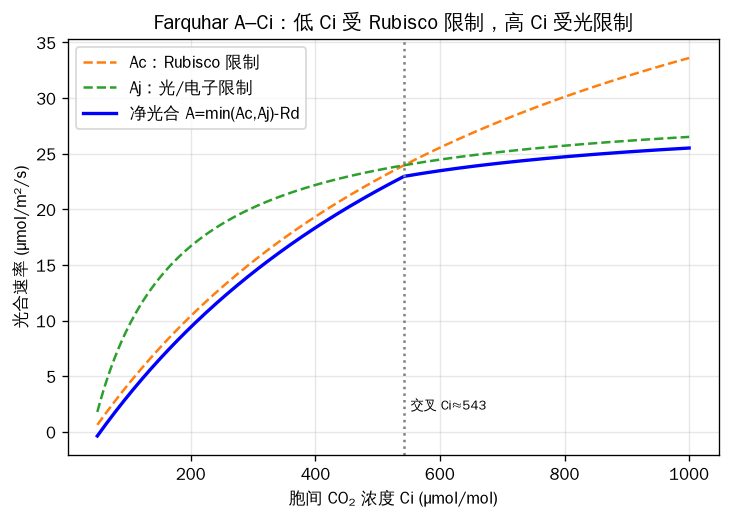

# 第四轮：水文 + 生态系统/陆面模型（中级→高级）——尺度等级与"概念 vs 物理"的张力

> 核心框架：Framework ④（尺度等级 / upscaling，升尺度）为主线，并引入能量平衡（surface energy balance）作为新的守恒律。
> 六个模型：SWAT、TOPMODEL、HYDRUS、Farquhar (FvCB)、LPJ/Biome-BGC、CLM5。

---

## SECTION 0：从第 1–3 轮搭桥过来

小白同学，先花两分钟回顾你已经掌握的东西——第 4 轮全部建立在它们之上：

- **第 1 轮**：守恒律（conservation law）+ 库与通量（pools & fluxes）+ 显式欧拉法（explicit Euler）。你学会了"浴缸模型"（bathtub）：水位变化 = 进水 − 出水，`dS/dt = inflow − outflow`，用 Logistic、RothC、AquaCrop 练手。
- **第 2 轮**：土壤生物地球化学。多库（multi-pool）周转、Michaelis-Menten 动力学（CENTURY、DNDC、DAYCENT、MIMICS）。
- **第 3 轮**：作物模型的"光→生物量→产量"骨架（light→biomass→yield），以及 de Wit 生产层级（潜在产量→水分限制→养分限制）。WOFOST/SUCROS、DSSAT、APSIM、EPIC、STICS。

**这一轮做什么？** 我们把空间镜头一下子拉宽：从一个点 / 一块田，扩展到**集水区（catchment）→ 景观（landscape）→ 区域（region）→ 全球（globe）**。贯穿全程的主线就是 **Framework ④：尺度等级与升尺度（hierarchy of scales / upscaling）**。

同时引入一条**新的守恒律**。第 1–3 轮你只用"质量守恒"（水和碳的收支）。这一轮加上**能量守恒**，具体形式是**地表能量平衡（surface energy balance）**：

> **Rn = H + LE + G**

逐符号解释：
- **Rn**：净辐射（net radiation，W·m⁻²），地表净得到的辐射能——相当于"收入"。
- **H**：感热通量（sensible heat flux，W·m⁻²），加热空气的那部分能量——你能用温度计感觉到。
- **LE**：潜热通量（latent heat flux，W·m⁻²），蒸散（evapotranspiration）带走的能量；L 是水的汽化潜热，E 是蒸散速率。
- **G**：地表（土壤）热通量（ground heat flux，W·m⁻²），传入土壤储存的能量。

**类比**：能量平衡就是一本"家庭收支账本"——收入（辐射 Rn）必须等于各项支出（H 加热空气、LE 蒸发水分、G 烤热土壤）之和。账永远要平。这条账本把第 1 轮的"质量守恒"升级成了"质量 + 能量双守恒"。

**这一轮的中心第一性张力（核心预告）**：同一个过程——**土壤水**——可以用差别极大的机理细致度来建模：
- **概念型"桶"模型（conceptual bucket）**：简单、稳健、参数少（如 tipping-bucket，被大多数作物模型和 SWAT 采用）。
- **物理型偏微分方程模型（physical PDE）**：Richards 方程，机理透彻但"吃数据"、数值上难搞（HYDRUS、APSIM-SWIM 采用）。

记住这句话，它是整轮的灵魂：**同一过程，可在迥然不同的机理细致度和空间尺度上建模。**

---

## SECTION 1：tipping-bucket vs Richards 方程（本轮的核心第一性原理）

土壤里的水怎么往下走？有两套互相竞争的范式。

### (a) Tipping-bucket / 容量法（capacity approach）

把土壤想象成**一摞桶**：每一层土是一个桶，每个桶有一个"满"的标准叫**田间持水量（field capacity）**。下雨时水先灌满最上面的桶；一旦超过田间持水量，多出来的水就"翻倒/溢出"（tip / spill），流进下一个桶，层层级联（cascade）。

**类比**：一座**层叠的溢流喷泉 / 一摞会满溢的水桶**——上面接满了就往下漏。

需要的参数极少：
- **field capacity（田间持水量）**：重力排水后土壤能"抓住"的水量上限。
- **wilting point（凋萎点）**：植物再也吸不动水的下限。
- **saturation（饱和含水量）**：所有孔隙都充满水。
- 这三者之间的差额就是"可用水"和"可排水"。

**优点**：稳定、快、参数好获取、适合长时间连续模拟。**这就是为什么 DSSAT、APSIM、WOFOST 等作物模型和 SWAT 全都用它**——直接接续第 3 轮作物模型的水分平衡，也直接接续第 1 轮的浴缸。

**缺点**：它不"懂"物理。它不知道毛细上升（capillary rise），对快速入渗、滞水、盐分/溶质运移这些精细过程是糊弄过去的。

### (b) Richards 方程（物理 PDE）

如果你想真正按物理定律追踪非饱和土壤中水的"推与拉"，就要用 **Richards 方程（Richards 1931）**。混合形式（mixed form）：

> **∂θ/∂t = ∂/∂z [ K(h) · (∂h/∂z + 1) ]**

逐符号解释：
- **θ**（theta）：体积含水量（volumetric water content，m³·m⁻³）——单位体积土里有多少水。
- **t**：时间。
- **z**：深度坐标（这里取向上为正，所以括号里是 +1；若向下为正则写 −1，注意不同教材约定不同）。
- **h**：基质势 / 压力水头（matric / pressure head，m）——土壤"吸水"的力，非饱和时为负值。
- **K(h)**：非饱和导水率（unsaturated hydraulic conductivity），它是 h（或 θ）的**强非线性函数**——这正是数值上最难的根源。
- 括号里的 `∂h/∂z` 是基质势梯度（毛细驱动），`+1` 是重力项。

**它从哪来？** 两条第一性原理的结合：
1. **质量守恒**（连续性方程，第 1 轮的老朋友）；
2. **Darcy–Buckingham 定律**（达西定律在非饱和土壤的推广：流量 ∝ 导水率 × 势梯度）。

把二者一合并，就得到 Richards 方程。

**还需要"本构关系"（constitutive relations）**：要解这个方程，必须知道 θ、h、K 三者怎么互相换算。最常用的是 **van Genuchten (1980, Soil Sci. Soc. Am. J. 44:892–898) 土壤水分特征曲线（soil water retention curve）**配合 **Mualem (1976)** 导水率模型，合称 **van Genuchten–Mualem**：

> **Se = [ 1 + (α·|h|)ⁿ ]^(−m)**，其中 **m = 1 − 1/n**

- **Se**：有效饱和度（effective saturation）= (θ − θr)/(θs − θr)。
- **θr / θs**：残余 / 饱和含水量。
- **α、n**：曲线形状的拟合参数。
- 用 van Genuchten–Mualem 在 HYDRUS 里求解 Richards 方程，需要 **6 个土壤水力参数：θr、θs、α、n、l、Ksat**（l 是孔隙连通性参数，Mualem 估为 0.5；Ksat 是饱和导水率）。

**类比**：Richards 方程是"追踪每一滴水分子受到的推力与拉力"——毛细的吸、重力的拽，逐点逐时算清楚。

**为什么机理强但难用？**
- **吃数据**：需要每种土壤的详细水力参数（θr、θs、α、n、Ksat…），田间很难测全。
- **数值上难**：K(h) 强非线性，需要很细的空间和时间离散；步长稍大就**不收敛（fails to converge）**或数值振荡。
- 这就是为什么它主要出现在科研级、剖面尺度的工具里：**HYDRUS（Šimůnek, van Genuchten & Šejna）、APSIM-SWIM**。HYDRUS 用数值方法求解 Richards 方程（描述饱和–非饱和水流）以及对流–弥散方程（描述热和溶质运移），并含一个根系吸水汇项。

### 同一场雨，两种范式各抓住/漏掉什么？

设想一场大暴雨打在同一块土上：
- **Tipping-bucket** 会说："表层桶满了→溢流到下层→还满→产生地表径流。" 它**抓住**了总水量收支、长期趋势；但**漏掉**了入渗锋（wetting front）的形状、雨强超过入渗能力时的瞬时积水、毛细再分布。
- **Richards** 会算出**入渗锋如何随时间向下推进**、表层如何短暂饱和、停雨后水如何靠毛细往上回吸。它**抓住**了机理细节；但**代价**是要喂给它精确的水力曲线，而且暴雨这种强非线性情形最容易让求解器崩。

**一句话总结**：要长期、稳健、少参数 → tipping-bucket；要机理、瞬态、溶质运移 → Richards。这正是本轮"概念 vs 物理"张力的最佳缩影。

### 可运行 Python：极简多层 tipping-bucket 土壤水模型（逐行注释）

```python
import numpy as np

# ---- 多层 tipping-bucket（fill-and-spill 级联）土壤水模型 ----
# 思想：每层是一个桶，超过 field capacity 的水溢流到下一层（第1轮浴缸的多层版）

n_layers = 4                     # 土壤分 4 层
fc  = np.array([30., 30., 30., 30.])   # 各层田间持水量 field capacity (mm)
wp  = np.array([12., 12., 12., 12.])   # 各层凋萎点 wilting point (mm)
sat = np.array([45., 45., 45., 45.])   # 各层饱和含水量 saturation (mm)
S   = np.array([20., 20., 20., 20.])   # 各层初始储水 (mm)

# 30 天的日降雨 (mm)，第10天来一场50mm大雨
rain = np.zeros(30); rain[10] = 50.; rain[3] = 15.; rain[20] = 25.
et_demand = 3.0                  # 每天蒸散需求 (mm)，从最上层先扣

deep_drainage = np.zeros(30)     # 记录每天渗出土体底部的水

for day in range(30):
    water_in = rain[day]                 # 当天进入土壤表层的水
    # --- 蒸散：从顶层扣，扣不动就往下层借（不低于 wilting point） ---
    et_left = et_demand
    for j in range(n_layers):
        avail = max(S[j] - wp[j], 0.0)   # 该层能贡献的可用水
        take  = min(avail, et_left)
        S[j] -= take
        et_left -= take
        if et_left <= 0: break
    # --- 入渗 + 级联溢流（fill and spill） ---
    for j in range(n_layers):
        S[j] += water_in                 # 先把来水灌进本层
        if S[j] > fc[j]:                 # 超过田间持水量就溢流
            water_in = S[j] - fc[j]      # 溢出的水量传给下一层
            S[j] = fc[j]                 # 本层留到田间持水量
        else:
            water_in = 0.0               # 没溢流，下层没水可接
        # 注：超过 saturation 的部分本应产生地表径流，这里简化省略
    deep_drainage[day] = water_in        # 最后还剩的 water_in = 渗出底部

print("总深层排水 (mm):", round(deep_drainage.sum(), 1))
print("末日各层储水 (mm):", np.round(S, 1))
```

**逐行读法**：`fc/wp/sat` 是三个关键阈值；主循环里先扣蒸散（顶层优先、不低于凋萎点），再做"灌入→超田持就溢流→传给下层"的级联。这就是 tipping-bucket 的全部精髓——**没有任何偏微分方程，只有阈值和溢流**。把 `fc` 调大，深层排水会减少（土壤更能蓄水）；把 `rain[10]` 调更大，溢流和深层排水会激增。

### 关于 Richards：仅给一个"概念草图"+ 强烈稳定性警告

> ⚠️ **不要**用朴素显式有限差分去解真实 Richards 方程——K(h) 强非线性，显式格式几乎一定数值爆炸或不收敛。真实求解用隐式 / 混合格式 + 迭代（HYDRUS 即如此）。

概念上，一维显式离散长这样（**仅示意，勿用于科研**）：把土柱分成若干网格 i，
`θ_i(t+Δt) = θ_i(t) + (Δt/Δz) · [ q_{i-1/2} − q_{i+1/2} ]`，
其中层间通量 `q = −K(h)·(Δh/Δz + 1)`（Darcy–Buckingham）。光是看这个就能体会：每一步都要根据当前 h 重算 K(h)，再算梯度，强非线性使得步长必须极小。这正是"物理细致度"的代价。

**框架连接**：本节直击 Framework ①（守恒律）③（简单 vs 复杂的权衡）④（同一过程多尺度多细致度），并回扣第 1 轮浴缸、第 3 轮作物模型水分平衡。

---

## SECTION 2：SWAT——集水区尺度、半分布式

### 第一性原理

**SWAT（Soil and Water Assessment Tool；Arnold, Srinivasan, Muttiah & Williams 1998, JAWRA 34:73–89）** 由美国农业部农业研究局（USDA-ARS）开发，是一个**概念型、连续时间**的流域模型。它的空间组织是一条清晰的等级链：

> **流域（watershed）→ 子流域（subbasins）→ 水文响应单元（HRUs）**

**HRU（Hydrologic Response Unit）= 土地利用 × 土壤 × 坡度的唯一组合**。同一个子流域里，所有"耕地+壤土+缓坡"的零碎地块被聚合成一个 HRU，统一算水分平衡。这是一个**关键的升尺度装置（Framework ④）**：它不去逐像元解空间，而是**把异质性聚合成"响应单元"**——相同响应的地块归为一类。

每个 HRU 按**水分平衡方程**逐日运行：土壤水变化 = 降水 − 地表径流 − 蒸散 − 入渗/侧流 − 深层渗漏。水、泥沙、养分、农药再通过**河网汇流（routing）**一路输送到流域出口。

**"半分布式"（semi-distributed）= 集总式（lumped）与全分布式（fully distributed）之间的折中**：比集总模型（把整个流域当一个桶）更能反映空间差异，又比全分布式（逐网格解 PDE）省得多。这是第 3 轮"简单模型哲学"的流域版。

### 地表径流：SCS 曲线数法（Curve Number）

SWAT 默认用 **SCS Curve Number 法**估算地表径流（也可选 Green-Ampt）：

> **Q = (P − 0.2S)² / (P + 0.8S)**，当 P > 0.2S 时；否则 Q = 0
> 其中 **S = 25400/CN − 254**（mm；用英寸时为 1000/CN − 10）

- **Q**：地表径流深（runoff，mm）。
- **P**：降雨量（mm）。
- **S**：径流开始后的最大潜在滞蓄量（potential maximum retention）。
- **0.2S**：初损（initial abstraction Ia）——产流前被截留/下渗掉的水。
- **CN**：曲线数（Curve Number，0–100），由土壤水文组（A/B/C/D）、土地利用、前期土壤湿度决定。**CN 越大→越易产流**（如城市硬化地面 CN 接近 98；疏松砂土林地 CN 低）。

**worked example（数值算例）**：某流域 CN=80，降雨 P=100 mm。
S = 25400/80 − 254 = 317.5 − 254 = **63.5 mm**；
Ia = 0.2 × 63.5 = 12.7 mm；
Q = (100 − 12.7)²/(100 + 0.8×63.5) = (87.3)²/(150.8) = 7621/150.8 ≈ **50.5 mm**。
**解读**：100 mm 雨里约 50 mm 变成地表径流，其余入渗/蒸发。若 CN 降到 70（更透水的土地管理），S=108.9 mm，Q≈30 mm——**改善土地覆被能显著削减径流**，这正是 SWAT 评估管理措施的用武之地。

**类比**：CN 是一张"土地的产流体质表"——同一场雨，铺了水泥的地（高 CN）哗哗流，松软的林地（低 CN）大半渗下去。

### 案例研究

- **大流域应用——上密西西比河流域（Upper Mississippi River Basin, UMRB）**：UMRB 排水面积 **492,000 km²**（主要横跨美国中部五个州），是墨西哥湾"死区"氮负荷的主要来源区之一。据 Goolsby et al. (1999) 对密西西比–阿查法拉亚河流域的核算，1980–1996 年间输往墨西哥湾的年均总氮通量约 1,568,000 t/年，其中约 61% 为硝酸盐态氮、37% 为有机氮、2% 为铵态氮，主要源区集中在明尼苏达南部、艾奥瓦、伊利诺伊、印第安纳和俄亥俄的农业流域。SWAT 被广泛用于模拟该区氮、磷、泥沙的非点源负荷，评估保护性耕作（conservation practices）的减负效果（Gassman 等多篇）。
- **非点源污染 / 养分负荷评估**：在不同土地管理情景下评估流域出口的硝酸盐、总氮、泥沙——这是 SWAT 最经典的应用类型。
- **应用基础极其庞大**：SWAT 已被美国 EPA 的 BASINS 软件包、USDA 的 CEAP 项目采用。据 SWAT 官方文献数据库（swat.tamu.edu, 2023），截至 2022 年 10 月，数据库收录的同行评议论文已**超过 6,000 篇、分布于近 900 种期刊**（Gassman et al. 2007, Trans. ASABE 50:1211–1250 是早期权威综述），并被重构为 SWAT+ 版（Bieger et al. 2017）。

**框架连接**：Framework ①（水分平衡 + 养分守恒）④（HRU 作为升尺度/聚合异质性的核心装置）。

---

## SECTION 3：TOPMODEL——地形驱动、变动产流区

### 第一性原理

**TOPMODEL（Beven & Kirkby 1979, Hydrological Sciences Bulletin 24:43–69）** 是水文学里最优雅、被引最多的模型之一。它的灵魂是一个单一指数——**地形湿度指数（Topographic Wetness Index, TWI）**：

> **TWI = ln(a / tanβ)**

- **a**：单位等高线长度上的**上坡汇水面积**（upslope contributing area per unit contour length，m²/m = m）——有多少坡面的水会汇到这一点。
- **tanβ**：**局地坡度**（local slope，β 是坡角）——水排走的快慢。
- **ln**：取自然对数。

**直觉**：上坡来水多（a 大）+ 坡缓排得慢（tanβ 小）→ TWI 大 → 这一点**最容易先湿、先饱和**。山谷底、汇流洼地 TWI 高；陡峭山脊 TWI 低。

**类比**：TWI 是一张**地形给每个点打的"湿度评分卡"**——光看地形（DEM）就能预测哪儿先积水，不用测降雨也不用测土壤。

由此产生 TOPMODEL 最重要的概念——**变动产流区（Variable Source Area, VSA）**：产生径流的饱和区不是固定的，它会**随湿润程度扩张和收缩**（下雨时从谷底向坡上蔓延，干旱时缩回谷底）。这是对"饱和超渗产流（saturation-excess runoff）"的精彩刻画。

### 三条关键假设（Beven et al. 1995 总结）

1. **地下水位坡度 ≈ 地表坡度**（水力梯度用地表坡近似）。
2. **稳态补给近似**（dynamic conditions 可用 steady-state 近似表示）。
3. **导水率随深度指数衰减**（saturated hydraulic conductivity decreases exponentially with depth）。

这些假设在**湿润、浅土、地形控制水位**的流域最成立。

### worked example：手算几个坡面单元的 TWI

设 3 个网格点，单位等高线长度均取 1 m：
- A 点：上坡汇水面积 a=100 m，坡度 tanβ=0.02（缓）→ TWI = ln(100/0.02) = ln(5000) ≈ **8.52**
- B 点：a=10 m，tanβ=0.10 → TWI = ln(10/0.10) = ln(100) ≈ **4.61**
- C 点：a=50 m，tanβ=0.25（陡）→ TWI = ln(50/0.25) = ln(200) ≈ **5.30**

**解读**：A 点 TWI 最高（汇水多 + 坡缓），最先饱和、最可能产流；B 点最干。这就是 TWI 把"地形异质性"压缩成一个可排序数字的威力——**parsimonious upscaling（简约升尺度）**的典范，也是第 3 轮"简单模型"哲学在水文里的化身。

### 可运行 Python：在小网格 DEM 上计算 TWI（简化版）

```python
import numpy as np

# 一个 5x5 的合成高程 DEM (m)，中间一条低洼汇流线
dem = np.array([
    [50, 49, 48, 49, 50],
    [49, 47, 45, 47, 49],
    [48, 45, 42, 45, 48],
    [47, 44, 41, 44, 47],
    [46, 43, 40, 43, 46],
], dtype=float)

cell = 10.0                     # 网格边长 (m)
# --- 简化坡度：用每个格子与8邻域最大下降算 tanβ ---
slope = np.zeros_like(dem)
for i in range(1, 4):
    for j in range(1, 4):
        nbrs = [dem[i-1,j], dem[i+1,j], dem[i,j-1], dem[i,j+1]]
        drop = max(dem[i,j] - min(nbrs), 0.1)   # 最大下降, 防止0
        slope[i,j] = drop / cell                  # tanβ
slope[slope == 0] = 0.001

# --- 简化汇水面积：地势越低假设上坡来水越多(仅教学示意) ---
# 真实计算需 D8/Dinf 流向算法; 这里用"相对高程低 => a 大"近似
a = (dem.max() - dem + 1) * cell * cell / cell    # 单位等高线长度的面积(示意)

TWI = np.log(a / slope)
print("TWI 矩阵(越大越湿):")
print(np.round(TWI, 2))
print("最湿单元位置:", np.unravel_index(np.nanargmax(TWI[1:4,1:4]), (3,3)))
```

> ⚠️ 注：真实 TWI 计算的关键和难点在于**汇水面积 a 的流向算法**（D8、D∞、多流向 MFD，见 Quinn et al. 1995）。上面 `a` 是教学示意，不是正确流向累积；目的是让你看到 `ln(a/tanβ)` 如何把地形变成湿度评分。中央低洼线 TWI 最高，符合"谷底先湿"的直觉。

### 案例研究

- **原始案例——Crimple Beck 集水区（英国约克郡，8 km²）**：TOPMODEL 最初就在这里应用（Beven & Kirkby 1979）。当年**没有数字高程模型**，地形指数全靠地图、航片和野外测量手算，"花了好几天高强度工作"。该论文最初被 *Journal of Hydrology* 以"过于局地"为由拒稿，后发表于 *Hydrological Sciences Bulletin*，如今成为水文学被引最高的论文之一。后续 Beven et al. (1984, J. Hydrol. 69:119–143) 在 Crimple Beck、Hodge Beck、Wye 三个英国流域验证，模型效率分别达 67%、58.2%、84.4%。
- **广泛用于饱和超渗产流**，并作为**陆面模型里的水文方案**：例如 CLM5 的地表径流用 SIMTOP（Niu et al. 2005），其底层就是 TOPMODEL 思路（Beven & Kirkby 1979）。

**框架连接**：Framework ④（用单一地形指数实现简约升尺度）+ 简约性（parsimony）哲学。

---

## SECTION 4：Farquhar（FvCB）生化光合模型

### 第一性原理

**Farquhar, von Caemmerer & Berry（1980, Planta 149:78–90, DOI 10.1007/BF00386231）** 是 C3 叶片光合作用的**生化模型**，是整个陆地生物圈建模的基石。它把净同化速率写成"两条流水线取最慢"：

> **A = min(Ac, Aj) − Rd**

- **A**：净 CO₂ 同化速率（net assimilation，µmol·m⁻²·s⁻¹）。
- **Ac**：**Rubisco 限制速率**（Rubisco-limited，酶促羧化能力封顶）。
- **Aj**：**RuBP 再生 / 电子传递限制速率**（RuBP-regeneration / electron-transport-limited，由光驱动的电子传递 J 封顶）。



<small>↑ Farquhar A–Ci：低 Ci 受 Rubisco 限制，高 Ci 受光限制，净光合取两者较小值。</small>

- **Rd**：白天 / 暗呼吸（day / dark respiration），要扣掉。
- **min(·)**：取两者中较小者——**谁是瓶颈，谁说了算**。

具体形式（FvCB 标准式）：

> **Ac = Vcmax · (Ci − Γ*) / [ Ci + Kc·(1 + O/Ko) ] − Rd**
> **Aj = J · (Ci − Γ*) / (4·Ci + 8·Γ*) − Rd**

逐符号：
- **Vcmax**：最大羧化速率（maximum carboxylation rate）——Rubisco 的"产能上限"。
- **Ci**：胞间 CO₂ 分压（intercellular CO₂）。
- **Γ\***（Gamma-star）：无暗呼吸时的 CO₂ 补偿点（CO₂ compensation point）。
- **Kc、Ko**：Rubisco 对 CO₂、O₂ 的 Michaelis-Menten 半饱和常数。
- **O**：O₂ 分压（竞争性抑制——O₂ 与 CO₂ 争夺 Rubisco，即光呼吸）。
- **J**：电子传递速率（随光强 PPFD 增大而饱和到 Jmax）。
- 注意 **Ac 是标准 Michaelis-Menten 形式**（带 O₂ 竞争项）——直接接续第 2 轮的 M-M 动力学！

**这是 Framework ②"限制因子律 / 木桶原理（law of the minimum）"在叶片尺度的生化化身**：低光时电子传递不够 → **Aj 限制**；高光但 CO₂ 低时 Rubisco 羧化封顶 → **Ac 限制**。

**类比**：min(Ac, Aj) = **两条装配线，最慢的那条决定整厂产量**；或"最慢的工人定节奏"。

### 它在尺度链中的位置

Farquhar 是**叶片尺度的引擎（leaf-level building block）**，被一路**升尺度（Framework ④）**：

> 叶片 (Farquhar) → 冠层 (canopy) → PFT → 网格 (grid cell) → 全球 (globe)

这和第 3 轮 SUCROS 的"叶片逐层光合"路线一脉相承，也与 RUE（辐射利用效率，第 3 轮的"简单"路线）形成对照：FvCB 是机理派，RUE 是经验派。

### 耦合气孔导度：A–gs 模型

光合不能脱离气孔。FvCB 通常与**气孔导度模型**耦合，形成 **A–gs 模型**：
- **Ball-Berry / Ball-Woodrow-Berry（1987）**：gs ∝ A·RH/Cs（经验型）。
- **Medlyn et al. (2011)**：基于最优化理论（optimal stomatal）。
CLM5 即采用 Farquhar 光合 + Medlyn 气孔导度。机理上：气孔供给 CO₂（supply）与光合需求 CO₂（demand，A=f(Ci)）在 Ci 处求交点（Farquhar & Sharkey 1982）。

### worked example + 可运行 Python：画 A–Ci 曲线，看 Ac/Aj 交叉

```python
import numpy as np
import matplotlib.pyplot as plt

# ---- 玩具版 Farquhar FvCB: A-Ci 曲线 ----
# 参数(25°C 典型值, 近似)
Vcmax = 80.0     # 最大羧化速率 µmol m-2 s-1
J     = 120.0    # 电子传递速率(给定光强下), µmol m-2 s-1
Kc    = 404.9    # Rubisco 对 CO2 的 M-M 常数 (µmol mol-1)
Ko    = 278.4e3  # 对 O2 的 M-M 常数 (µmol mol-1)
O     = 210e3    # O2 分压 (µmol mol-1, ~21%)
Gstar = 42.75    # CO2 补偿点 Γ* (µmol mol-1)
Rd    = 1.0      # 暗呼吸 µmol m-2 s-1

Ci = np.linspace(40, 800, 200)   # 胞间 CO2 从低到高

# Rubisco 限制速率 Ac (Michaelis-Menten 形式, 带 O2 竞争)
Ac = Vcmax * (Ci - Gstar) / (Ci + Kc * (1 + O/Ko))
# 电子传递限制速率 Aj
Aj = J * (Ci - Gstar) / (4*Ci + 8*Gstar)
# 净同化 = 两者取小 - 暗呼吸
A  = np.minimum(Ac, Aj) - Rd

plt.figure(figsize=(7,5))
plt.plot(Ci, Ac, '--', label='Ac (Rubisco-limited)')
plt.plot(Ci, Aj, ':',  label='Aj (electron-transport-limited)')
plt.plot(Ci, A, 'k-', lw=2, label='A = min(Ac,Aj) - Rd')
plt.xlabel('Ci (µmol mol⁻¹)'); plt.ylabel('A (µmol m⁻² s⁻¹)')
plt.legend(); plt.title('Farquhar A–Ci curve'); plt.grid(alpha=.3)
# plt.show()

# 找交叉点(限制因子切换处)
idx = np.argmin(np.abs(Ac - Aj))
print(f"Ac/Aj 交叉发生在 Ci ≈ {Ci[idx]:.0f} µmol/mol")
print("低 Ci 段由谁限制:", "Ac(Rubisco)" if Ac[0]<Aj[0] else "Aj")
```

**解读**：低 Ci（CO₂ 稀缺）时 **Ac < Aj**，是 **Rubisco 限制**（曲线初始陡升段）；高 Ci 时 Rubisco 不再是瓶颈，**Aj < Ac**，转为**电子传递/RuBP 再生限制**（曲线平台段）。**黑线（实际 A）始终贴着两条线里较低的那条**——这就是木桶原理的可视化。实验上，正是用 A–Ci 曲线的初始斜率反推 **Vcmax**、平台段反推 **Jmax**。

### 案例研究

- **几乎所有 DGVM 和陆面模型都采用 FvCB**：LPJ、CLM、Biome-BGC、JULES 等。据 De Kauwe et al. (2015, Geosci. Model Dev. 8:431) 援引 De Kauwe et al. (2013a) 的模型互比研究："**In a recent inter-comparison study, 10 of the 11 ecosystem models considered applied some form of the 'Ball–Berry–Leuning' approach**"——即 11 个生态系统模型中有 10 个使用 Ball–Berry–Leuning 型气孔方案耦合 FvCB。
- **解读叶片气体交换测量**：A–Ci 曲线拟合估计 Vcmax、Jmax，是植物生理学的标准操作。

**框架连接**：Framework ②（限制因子律）④（叶片→全球的升尺度起点）。

---

## SECTION 5：LPJ / Biome-BGC——动态全球植被模型（DGVM）

### 第一性原理

**LPJ（Lund–Potsdam–Jena；Sitch et al. 2003, Global Change Biology 9:161–185, DOI 10.1046/j.1365-2486.2003.00569.x）** 和 **Biome-BGC（Thornton & Running）** 是动态全球植被模型的代表。核心思想：用少数几个**植物功能型（Plant Functional Types, PFTs）**代表全球植被，它们**竞争资源（光、水）**，并耦合**碳-水循环**。Sitch et al. (2003) 原文："**Ten plant functional types (PFTs) are differentiated by physiological, morphological, phenological, bioclimatic and fire-response attributes**"——即 LPJ 用 **10 个 PFT** 区分全球自然植被。

> Biome-BGC 模拟陆地生态系统的水、碳、氮的储量与通量（Thornton et al. 2002, Agric. For. Meteorol. 113:185–222）；它是最早把碳、水、养分循环显式耦合的生物地球化学模型之一。

### 本节最重要的教学点：快-慢过程耦合（fast–slow coupling）

这是 Framework ④ 的**时间尺度等级**（不只是空间）。DGVM 把过程按时间步长分两层：

| 快过程（daily / sub-daily 步长） | 慢过程（annual 步长） |
|---|---|
| 光合（Farquhar）、气孔导度 | 植被结构、PFT 种群密度 |
| 蒸散（ET）、土壤水动态 | 定植（establishment）、死亡（mortality） |
| | 火灾（fire）、竞争（competition） |

Sitch et al. (2003) 原文即明确："**Photosynthesis, evapotranspiration and soil water dynamics are modelled on a daily time step, while vegetation structure and PFT population densities are updated annually.**"

**类比**：快-慢耦合 = **天气 vs 气候**，或**日常琐事 vs 人生大决策**。你每天都在吃饭睡觉（光合、蒸散——快），但"换工作、搬家、改行"这种结构性改变是按年发生的（PFT 更替、演替——慢）。模型让两套时钟同时走，快过程的累积结果（一年的碳收支）驱动慢过程（哪种 PFT 扩张/衰退）。

### 升尺度链

> 叶片 (Farquhar) → 冠层 → PFT → 网格 → 全球

注意：**第 2 轮的土壤碳库（soil carbon pools）就活在这些模型内部**——LPJ/Biome-BGC 里都有 litter、soil organic matter 库，按温度湿度调控的分解（Arrhenius / Q10）驱动异养呼吸 Rh。第 4 轮没有抛弃第 2 轮，而是把它装进了更大的盒子。

### worked example（概念）：一个网格的 PFT 组成如何随升温几十年漂移

设某温带网格初始为"温带落叶阔叶林 PFT"主导。持续升温几十年：
1. **快过程**逐日算出：升温→蒸散需求增、夏季土壤水亏缺加剧→该 PFT 年净初级生产力（NPP）下降。
2. **慢过程**逐年结算：NPP 下降→定植率降、死亡率升；与此同时更耐热耐旱的"温带针叶"或"草本 PFT"竞争力相对上升。
3. 几十年累积：网格的 PFT 分数（fractional cover）从"阔叶林为主"逐渐**漂移**为"针叶/草本混合"——这就是模型模拟的植被带迁移（biome shift），如 Lapola et al. (2009) 模拟的亚马逊"森林→稀树草原"转变。

### 案例研究

- **全球陆地碳汇/源估算**：LPJ 类模型是全球碳收支（Global Carbon Budget, Friedlingstein et al. 系列）所依赖的陆地生物圈模型之一。
- **LPJmL 扩展到作物 + 管理用地 + 灌溉**：Bondeau et al. (2007, GCB 13:679–706) 引入**作物功能型（Crop Functional Types, CFTs）**（11 种作物 + 2 种管理草地，共 13 CFT），评估农业对 20 世纪全球陆地碳收支的作用；此后 LPJmL 成为研究农业生产、灌溉需水的标准工具（Schaphoff et al. 2018, GMD 11:1343–1403）。
- **CO₂ 施肥效应与径流研究**：LPJ 用于模拟 CO₂ 升高下蒸腾下降、径流变化（Gerten et al.）。

**框架连接**：Framework ④（空间**和**时间双重尺度等级）+ 回扣第 2 轮（土壤碳库内嵌其中）。

---

## SECTION 6：CLM——Community Land Model，集大成的顶点

### 第一性原理

**CLM5（Lawrence et al. 2019, JAMES 11:4245–4287, DOI 10.1029/2018MS001583）** 是 **CESM2（Community Earth System Model 2）的陆面分量**，处在"机理最复杂、最集成"的一端。它在一个**嵌套子网格等级（nested subgrid hierarchy）**上，大约**半小时（half-hourly）**步长，同时求解：

> **地表能量平衡 + 水分平衡 + 碳-氮循环（carbon–nitrogen cycling）**

**能量平衡是本轮的新守恒律**，CLM 把它解得很细：

> **Rn = H + LE + G**（净辐射 = 感热 + 潜热 + 地表热通量）

（各符号见 SECTION 0。CLM 进一步把 H、LE 分解为地面/冠层、蒸发/蒸腾各分量。能量平衡与蒸散的桥梁是 Penman–Monteith 方程，由 Penman 1948 与 Monteith 1965 奠定。）

### 嵌套子网格等级——Framework ④ 的空间化身

> **网格单元（grid cell）→ 土地单元（land units）→ 柱（columns）→ 植物功能型斑块（PFT patches）**

- **land units**：植被、湖泊、城市、冰川、作物（CLM5 五类）。
- 每个 land unit 可含多个 **column**（如不同土壤柱、雪柱）。
- 每个 column 可含多个 **PFT/CFT patch**（植被 land unit 最多 15 个 PFT + 裸地）。
- 同一网格内各子单元用**面积权重平均**汇总成网格通量返回大气。

这正是"**用嵌套等级表达地表异质性**"——Framework ④ 的教科书式实现。它和 SWAT 的 HRU、LPJ 的 PFT 是同一思想（聚合异质性）在不同复杂度上的体现。

### CLM5 的新增过程

Lawrence et al. (2019) 列出的更新包括：**植物水力学（plant hydraulics）**、修订的**氮循环**（柔性叶片化学计量、为光合优化叶氮、植物吸氮的碳成本）、**全球作物模型**（6 种作物 + 时变灌溉与施肥）、修订的雪与地下水水文、火灾、城市建筑能量、更新的气孔生理（Medlyn）。CLM5 也用 **TOPMODEL 思路的 SIMTOP** 算地表径流——**第 3 节的 TOPMODEL 就嵌在这里**。

### 案例研究

- **ILAMB 基准测试（International Land Model Benchmarking）**：CLM5 用 ILAMB 系统对全球能量、水、碳收支做系统评估（Collier et al. 2018；Lawrence et al. 2019）。Bonan et al. (2019, GBC) 显示从 CLM4→CLM4.5→CLM5 碳循环逐步改善（土壤碳除外）。ILAMB 也被全球碳计划（Global Carbon Project）常规用于评估陆地生物圈模型。
- **高斯过程仿真器（Gaussian-process emulator）做参数敏感性**：**Gao, Avramov, Saikawa & Schlosser (2021, Journal of Hydrometeorology 22(2):259–278, DOI 10.1175/JHM-D-20-0043.1)** 针对 CLM5 **土壤湿度**构建高斯过程仿真器，在 5 个土壤相关参数（孔隙度 porosity、饱和基质势、饱和导水率、土壤水分保持模型形状参数 shape parameter、有机质分数）构成的五维参数空间做方差型（Sobol）敏感性分析。关键发现（原文）："**The uncertainties of surface and root-zone soil moisture are dominated by the uncertainties in porosity and shape parameter with negligible parametric interactions.**"——即**孔隙度和形状参数主导土壤湿度不确定性**，且二者随土壤质地、深度、季节而此消彼长。
- **嵌入地球系统模型做气候预估**：CLM5 作为 CESM2 陆面分量参与 CMIP6 气候情景模拟。

### 参数之多 → Framework ⑥（不确定性）

CLM 是一个**参数数以百计**的庞然大物。Dagon et al. (2020, ASCMO 6:223–244) 在敏感性研究中一次性扰动了 **34 个 CLM5 生物物理参数**（原文："**34 CLM5 biophysical parameters … a mix of empirically derived parameters (10) and parameters that describe biophysical properties (24)**"），再筛出 6 个做扰动参数集合（PPE，100 组拉丁超立方采样）。社区级的 CLM5 参数扰动集合项目（CLM5PPE）更识别出"**200+ model parameters**"横跨能量、水、碳、氮（项目级资料，非期刊正式发表，谨此标注）。**参数越多→可调空间越大→不确定性与等效性（equifinality）问题越突出**——这把我们引向 Framework ⑥（不确定性量化），也是后续轮次的伏笔。

**CLM 集成了一切**：能量、水、碳、氮、植被动态——它是本轮（也是整条机理建模光谱）复杂度的顶点。

**框架连接**：Framework ④（嵌套空间等级 + 快慢时间步）⑥（数以百计参数→不确定性）。

---

## SECTION 7：六个模型的共性与差异（统一图景）

| 模型 | 领域 domain | 空间尺度 | 核心控制原理 | 概念 vs 物理 | 时间步长 | 招牌优势 | 难度 |
|---|---|---|---|---|---|---|---|
| **SWAT** | 水文+水质 | 子流域/集水区 | 水分平衡 + 养分输送 + SCS-CN；HRU 聚合 | 概念型 | 日 | 大流域管理/非点源污染评估 | 中 |
| **TOPMODEL** | 水文（产流） | 山坡/集水区 | TWI = ln(a/tanβ)；变动产流区 | 概念型（半物理） | 日/事件 | 极简约、地形驱动 | 低-中 |
| **HYDRUS** | 土壤水/溶质 | 点/剖面 (1D-3D) | Richards 方程 + van Genuchten-Mualem | 物理型 PDE | 秒-分（自适应） | 机理最细的非饱和流 | 高 |
| **Farquhar (FvCB)** | 叶片光合 | 叶片 | A = min(Ac, Aj) − Rd | 机理（生化） | 瞬时/sub-daily | 全球光合的通用引擎 | 中 |
| **LPJ / Biome-BGC** | 生态系统/植被 | 网格→全球 | 快-慢耦合 PFT 动态 + 碳水循环 | 机理（过程型） | 日（快）+ 年（慢） | 全球植被动态与碳汇 | 高 |
| **CLM5** | 陆面（集大成） | 嵌套子网格→全球 | 能量 + 水 + 碳氮平衡 | 物理+机理 | ~半小时 | 集成一切；ESM 陆面分量 | 极高 |

### 本轮核心，再强调一遍

**同一批过程（水、碳、能量），可以在迥然不同的机理细致度和空间尺度上建模**（Framework ④）——从**简约端**（TOPMODEL 一个地形指数、tipping-bucket 几个阈值）到**全物理端**（Richards 偏微分方程、CLM 数百参数解能量+水+碳+氮）。没有"最好的模型"，只有"对你的问题、数据、尺度最合适的模型"。

### 改变尺度（change-of-support）的提醒

升尺度不是"把小格子的数平均一下"那么简单。由于过程的非线性（如 K(h)、min(Ac,Aj)、产流阈值），**先平均输入再算，与先逐点算再平均输出，结果往往不同**——这就是"change-of-support / 改变支撑域"问题。各模型的应对正是它们的升尺度装置：SWAT 用 HRU 聚合、LPJ 用 PFT 分数、CLM 用嵌套子网格 + 面积加权，TOPMODEL 用 TWI 的统计分布——都是为了在变大尺度时尽量保住异质性的非线性效应。

### 跨轮次的明确连接

- **Farquhar 是"芯片"**：它是第 3 轮冠层模型（SUCROS）和本轮 DGVM（LPJ/CLM）共用的叶片级引擎。
- **Tipping-bucket 串起三轮**：第 1 轮浴缸 → 第 3 轮作物模型水分平衡 → 本轮 SWAT/作物模型土壤水。
- **第 2 轮土壤碳库内嵌于 LPJ/CLM**：多库 + M-M/Q10 分解没有消失，只是被装进全球模型。
- **能量平衡是新守恒律**：把第 1 轮的"质量守恒"扩展为"质量 + 能量"双账本（Penman-Monteith 把能量平衡与蒸散连起来：Penman 1948、Monteith 1965）。

---

## SECTION 8：第四轮练习 / 里程碑

### 动手练习（建议按顺序做）

1. **跑 tipping-bucket 模型，调参数**：运行 SECTION 1 的代码，把 `fc`（田间持水量）从 30 调到 15 和 45，观察深层排水如何变化；再把 `rain[10]` 从 50 调到 100，看溢流与产流。**思考**：为什么田持越大、深层排水越少？
2. **手算 + 代码算 TWI**：用 SECTION 3 的合成 DEM，手算中央洼地与角落山脊两点的 TWI，再跑代码验证，找出"最湿单元"。**思考**：把坡度 tanβ 减半，TWI 怎么变？
3. **画 A–Ci 曲线，找 Ac/Aj 交叉**：跑 SECTION 4 的 Farquhar 代码，把光强相关的 `J` 从 120 降到 40（模拟弱光），观察曲线平台下降、交叉点左移——**弱光下 Aj 更早成为瓶颈**。
4. **概念对比：暴雨入渗下 tipping-bucket vs Richards**：用文字写出一场 80 mm 暴雨打在干燥黏土上，两种模型各会预测什么（入渗锋？瞬时积水？产流时机？），各漏掉什么。
5. **追踪快-慢耦合**：列一张表，把 DGVM 里的过程分到"逐日更新"和"逐年更新"两栏（至少各 4 项），并说明慢过程如何被快过程的累积结果驱动。
6. **画地表能量平衡分配**：给定 Rn = 500 W·m⁻²，画三种情形下 Rn 如何分配成 H/LE/G——（a）湿润有水的农田（LE 大），（b）干旱裸地（H 大），（c）夜间（Rn 变负，G 反向）。**思考**：灌溉如何改变 H 与 LE 的分配（即 Bowen 比 H/LE）？

### "你已经掌握第 4 轮，如果你能……"清单

- [ ] 用自己的话解释 **tipping-bucket 与 Richards 方程**的本质区别，并各举一个使用它的模型。
- [ ] 写出 **Richards 方程**并解释每个符号，说明它来自质量守恒 + Darcy-Buckingham，以及为什么数值上难解。
- [ ] 写出并计算 **TWI = ln(a/tanβ)**，解释为什么高 TWI 点先饱和，并说明"变动产流区"。
- [ ] 写出 **A = min(Ac, Aj) − Rd**，解释低光与低 CO₂ 下各由谁限制，并把它和 Framework ②（限制因子律）联系起来。
- [ ] 解释 DGVM 的**快-慢过程耦合**：哪些过程逐日、哪些逐年，并用"天气 vs 气候"类比。
- [ ] 写出**地表能量平衡 Rn = H + LE + G** 并解释每项，说明它是本轮新增的守恒律。
- [ ] 描述 **point→field→region→globe** 的升尺度链，并指出 SWAT 的 HRU、CLM 的嵌套子网格、LPJ 的 PFT 都是"聚合异质性"的升尺度装置（Framework ④），以及为什么 change-of-support 让升尺度不只是简单平均。
- [ ] 解释 **Farquhar 如何从叶片一路升尺度**到 LPJ/CLM 这样的全球模型，并指出它同时是第 3 轮冠层模型的引擎。

---

> **本轮一句话**：水、碳、能量这三件事，既能用一摞水桶和一个地形评分卡简约地算（TOPMODEL、tipping-bucket），也能用偏微分方程和数百参数的嵌套巨模型精细地算（Richards、CLM）——**Framework ④ 教你的，正是在正确的尺度、用正确的细致度，提出正确的问题。**

---

### 主要文献（primary sources）
- Arnold, J.G., Srinivasan, R., Muttiah, R.S. & Williams, J.R. (1998). *Large Area Hydrologic Modeling and Assessment Part I: Model Development.* JAWRA 34(1):73–89.
- Beven, K.J. & Kirkby, M.J. (1979). *A physically based, variable contributing area model of basin hydrology.* Hydrological Sciences Bulletin 24(1):43–69.
- Richards, L.A. (1931). *Capillary conduction of liquids through porous mediums.* Physics 1:318–333.
- van Genuchten, M.Th. (1980). *A closed-form equation for predicting the hydraulic conductivity of unsaturated soils.* Soil Sci. Soc. Am. J. 44:892–898.
- Šimůnek, J., van Genuchten, M.Th. & Šejna, M. — HYDRUS 软件系列（求解 Richards 方程 + van Genuchten–Mualem）。
- Farquhar, G.D., von Caemmerer, S. & Berry, J.A. (1980). *A biochemical model of photosynthetic CO₂ assimilation in leaves of C3 species.* Planta 149:78–90.
- Sitch, S. et al. (2003). *Evaluation of ecosystem dynamics, plant geography and terrestrial carbon cycling in the LPJ dynamic global vegetation model.* Global Change Biology 9:161–185.
- Thornton, P.E. et al. (2002). *Modeling and measuring the effects of disturbance history and climate on carbon and water budgets in evergreen needleleaf forests.* Agric. For. Meteorol. 113:185–222.（Biome-BGC）
- Bondeau, A. et al. (2007). *Modelling the role of agriculture for the 20th century global terrestrial carbon balance.* GCB 13:679–706.（LPJmL）
- Lawrence, D.M. et al. (2019). *The Community Land Model Version 5.* JAMES 11:4245–4287.
- Penman, H.L. (1948); Monteith, J.L. (1965). 能量平衡 / 蒸散的 Penman-Monteith 框架。


---

## 🧪 动手练习（配套脚本）

读完这一轮，去跑配套练习，把核心机理亲手验证一遍——SCS-CN 产流 + Farquhar Ac/Aj 交叉：

```bash
cd exercises && python3 round4_exercise.py
```

→ 脚本：[`exercises/round4_exercise.py`](exercises/round4_exercise.py) ｜ 全部练习说明见 [`exercises/README.md`](exercises/README.md)
